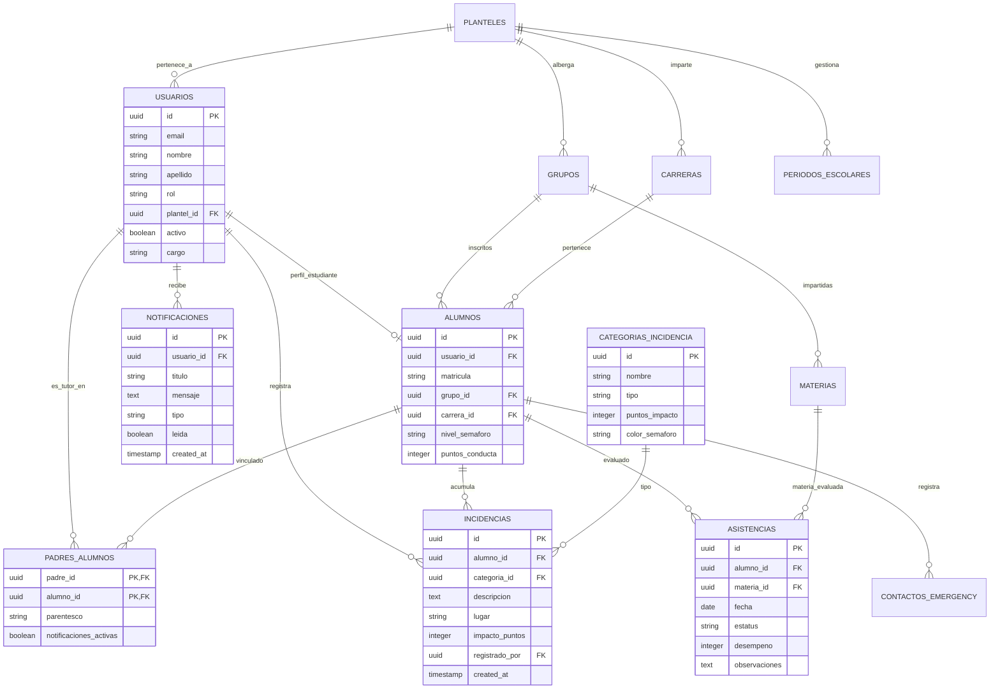
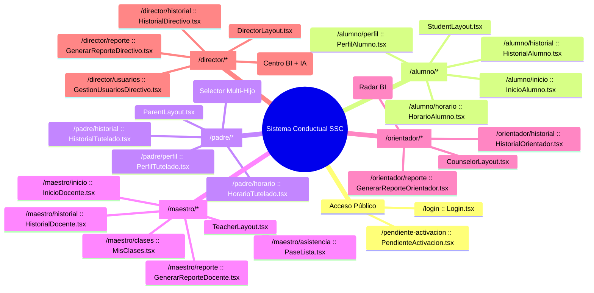
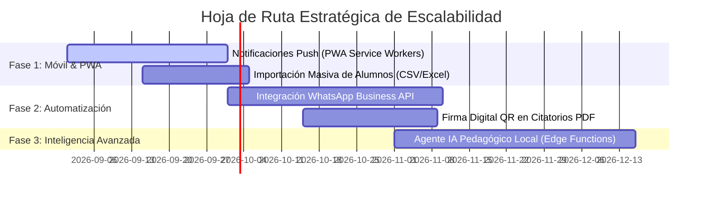

# 📚 TESINA Y MEMORIA TÉCNICA DE ARQUITECTURA
## "DISEÑO, ARQUITECTURA E IMPLEMENTACIÓN DEL SISTEMA CONDUCTUAL CONALEP (SSC): PLATAFORMA WEB INTEGRAL DE SEMAFORIZACIÓN CONDUCTUAL EN TIEMPO REAL, PASE DE LISTA E INTELIGENCIA DE NEGOCIOS"

---

**Autor / Equipo:** Desarrollo & Arquitectura de Software  
**Institución / Proyecto:** CONALEP — Sistema Conductual (SSC)  
**Versión del Sistema:** 3.0 Master Release (Producción Estabilizada)  
**Fecha de Validación:** 3 de Agosto, 2026  
**Resultado de Compilación:** `npx vite build` — 729 módulos transformados (0 errores, 0 advertencias)  

---

## ÍNDICE GENERAL

1. [Capítulo I: Marco Teórico y Planteamiento del Problema](#capítulo-i-marco-teórico-y-planteamiento-del-problema)
   - 1.1 Planteamiento del Problema en la Educación Media Superior
   - 1.2 Objetivos del Sistema (General y Específicos)
   - 1.3 Justificación Técnica y Social
   - 1.4 Delimitación y Alcance por Roles
2. [Capítulo II: Arquitectura Tecnológica y Patrones de Diseño](#capítulo-ii-arquitectura-tecnológica-y-patrones-de-diseño)
   - 2.1 Stack Tecnológico Seleccionado
   - 2.2 Patrón de Arquitectura por Capas
   - 2.3 Modelo de Seguridad RBAC y Code-Splitting por Rol
   - 2.4 Diagramas de Arquitectura Global de Infraestructura
3. [Capítulo III: Diseño y Modelado de la Base de Datos](#capítulo-iii-diseño-y-modelado-de-la-base-de-datos)
   - 3.1 Modelo Entidad-Relación (Diagrama ERD Completo)
   - 3.2 Catálogo Extenso de Tablas, Campos, Tipos de Datos y Restricciones
   - 3.3 Código DDL Completo en SQL (Scripts Ejecutables)
   - 3.4 Algoritmo de Semaforización Conductual y Triggers Automáticos
   - 3.5 Funciones Almacenadas (RPCs PL/pgSQL) del Centro BI
   - 3.6 Matriz de Seguridad a Nivel de Fila (Row Level Security - RLS)
4. [Capítulo IV: Diseño de la Interfaz y Sistema de Diseño (Frontend)](#capítulo-iv-diseño-de-la-interfaz-y-sistema-de-diseño-frontend)
   - 4.1 Tokens de Diseño CSS, Paleta de Colores y Modo Oscuro
   - 4.2 Mapa de Rutas, Layouts y Sitemap RBAC
   - 4.3 Arquitectura Multi-Tutelado para Padres de Familia
   - 4.4 Integración del Agente Ejecutivo de Inteligencia Artificial
5. [Capítulo V: Metodología de Desarrollo, Pruebas y Mega Migración](#capítulo-v-metodología-de-desarrollo-pruebas-y-mega-migración)
   - 5.1 Historial Completo de Corrección de Hallazgos del Piloto
   - 5.2 Proceso de Mega Migración por Roles
   - 5.3 Protocolo de Pruebas y Validación de Compilación
6. [Capítulo VI: Guía de Despliegue, Entorno y Mantenimiento](#capítulo-vi-guía-de-despliegue-entorno-y-mantenimiento)
   - 6.1 Configuración de Variables de Entorno
   - 6.2 Manual de Instalación y Mantenimiento
7. [Capítulo VII: Conclusiones y Hoja de Ruta Futura (Roadmap)](#capítulo-vii-conclusiones-y-hoja-de-ruta-futura-roadmap)
   - 7.1 Conclusiones Técnicas
   - 7.2 Plan de Evolución Tecnológica (Línea de Tiempo)

---

## CAPÍTULO I: MARCO TEÓRICO Y PLANTEAMIENTO DEL PROBLEMA

### 1.1 Planteamiento del Problema en la Educación Media Superior
En la Educación Media Superior (EMS), factores como la falta de seguimiento oportuno a faltas disciplinarias, el ausentismo no detectado a tiempo y la limitada comunicación entre la institución educativa y los tutores legales constituyen causas primarias de reprobación y deserción escolar.

Los sistemas tradicionales de gestión escolar suelen ser puramente administrativos (captura de calificaciones finales al concluir el semestre), careciendo de mecanismos de **alerta temprana** que permitan intervenir pedagógica o psicológicamente mientras el estudiante aún se encuentra a tiempo de recuperar su trayectoria académica.

### 1.2 Objetivos del Sistema
#### Objetivo General:
Diseñar, construir e implementar una plataforma web progresiva e integral denominada **Sistema Conductual CONALEP (SSC)**, orientada al monitoreo en tiempo real del estatus conductual de los estudiantes mediante un algoritmo de semaforización automática (**Verde**, **Naranja**, **Rojo**), pase de lista diario por materia, notificación preventiva a tutores legales y análisis ejecutivo de indicadores (BI).

#### Objetivos Específicos:
1. Automatizar el cálculo del índice conductual de cada estudiante a partir del registro estandarizado de reconocimientos positivos y faltas disciplinarias.
2. Garantizar la comunicación inmediata con padres de familia a través de notificaciones preventivas y un portal dedicado con soporte nativo para **múltiples tutelados**.
3. Dotar a los profesores de una herramienta ágil para el pase de lista diario por materia, registrando simultáneamente niveles de desempeño y asistencia.
4. Proveer a Orientadores y Directivos de un Centro de Inteligencia de Negocios (BI) asistido por Inteligencia Artificial para la toma de decisiones institucionales.
5. Implementar un modelo de seguridad estricto a nivel de base de datos (*Row Level Security — RLS*) que aísle la información entre planteles y garantice que cada rol acceda únicamente a los datos que le corresponden.

### 1.3 Justificación Técnica y Social
- **Justificación Social:** Favorece la permanencia escolar, la cultura de paz y la corresponsabilidad de los padres de familia en la educación de sus hijos.
- **Justificación Técnica:** La migración a una arquitectura moderna basada en **React 18 + Vite + Supabase (PostgreSQL)** permite reducir los tiempos de respuesta a milisegundos, eliminar fallas por concurrencia y ofrecer un sistema ligero que funciona con fluidez en computadoras de escritorio y dispositivos móviles.

### 1.4 Delimitación y Alcance por Roles
El sistema delimita las responsabilidades de 5 actores clave:

| Rol | Alcance y Responsabilidades Principales |
| :--- | :--- |
| **`alumno`** | Consulta su semáforo personal, puntaje acumulado, horario de clases e historial de reportes. |
| **`padre`** | Monitorea el estatus de sus hijos tutelados (con selector multi-hijo), consulta sus horarios y recibe alertas preventivas. |
| **`docente`** | Realiza el pase de lista diario, evalúa el desempeño por materia y genera reportes disciplinarios de sus grupos. |
| **`orientador`** | Analiza el Radar BI de alumnos en riesgo, atiende expedientes conductuales y emite reportes de plantel. |
| **`directivo`** | Accede al Centro BI global, consulta reportes ejecutivos resumidos por la IA y administra usuarios/cuentas. |

---

## CAPÍTULO II: ARQUITECTURA TECNOLÓGICA Y PATRONES DE DISEÑO

### 2.1 Stack Tecnológico Seleccionado
La selección de tecnologías responde a criterios de mantenibilidad, tipo estricto, velocidad de carga y rendimiento de base de datos:

- **Frontend:** React 18.3, TypeScript 5.5, Vite 8.1.
- **Enrutamiento:** React Router DOM v6.
- **Sistema de Estilos:** Vanilla CSS con CSS Variables (Design System tokens) y soporte de Modo Oscuro nativo (`data-theme='dark'`).
- **Backend & Persistence:** Supabase Cloud (PostgreSQL 15+).
- **Autenticación & RBAC:** Supabase Auth (GoTrue con Tokens JWT) + Middleware custom `RequireAuth`.
- **Inteligencia Artificial:** Agente ejecutivo conversacional para interpretación de tableros BI.

### 2.2 Patrón de Arquitectura por Capas

```
┌────────────────────────────────────────────────────────────────────────┐
│                        CAPA DE PRESENTACIÓN (CLIENTE)                  │
│  - React 18 + Vite Code-Splitting                                      │
│  - Portales por Rol: Alumno, Padre, Docente, Orientador, Directivo     │
│  - Design System Tokens (CSS Variables + Modo Oscuro)                  │
└───────────────────────────────────┬────────────────────────────────────┘
                                    │ HTTPS / REST / Realtime Websockets
┌───────────────────────────────────▼────────────────────────────────────┐
│                        CAPA DE LÓGICA Y SEGURIDAD                      │
│  - React Router v6 Guards (RequireAuth RBAC)                           │
│  - Supabase JS Client & Services Layer (services/bi.ts)                │
│  - Helper de Traducción de Errores RLS (lib/supabaseClient.ts)         │
└───────────────────────────────────┬────────────────────────────────────┘
                                    │ PostgreSQL Native Protocol / SQL
┌───────────────────────────────────▼────────────────────────────────────┐
│                        CAPA DE DATOS Y MOTOR BI (POSTGRESQL)           │
│  - Kernel Row Level Security (RLS) con Funciones SECURITY DEFINER      │
│  - Procedimientos Almacenados (RPCs PL/pgSQL fn_bi_*)                  │
│  - Triggers de Recálculo de Semáforo y Notificaciones Automáticas      │
└────────────────────────────────────────────────────────────────────────┘
```

### 2.3 Modelo de Seguridad RBAC y Code-Splitting por Rol
Para evitar que el bundle inicial cargue código innecesario, la aplicación implementa importaciones perezosas (`React.lazy()`). Cada ruta principal está protegida por un contenedor de autorización `RequireAuth`:

```typescript
function RequireAuth({ allowedRoles, children }: { allowedRoles: string[]; children: ReactNode }) {
  const { session, rol, loading } = useAuth();
  if (loading) return <LoadingSpinner />;
  if (!session) return <Navigate to="/login" replace />;
  if (rol === 'pendiente') return <Navigate to="/pendiente-activacion" replace />;
  if (!rol || !allowedRoles.includes(rol)) {
    return <Navigate to={resolverRutaInicio(rol)} replace />;
  }
  return children;
}
```

### 2.4 Diagramas de Arquitectura Global de Infraestructura


---

## CAPÍTULO III: DISEÑO Y MODELADO DE LA BASE DE DATOS

### 3.1 Modelo Entidad-Relación (Diagrama ERD Completo)



### 3.2 Catálogo Extenso de Tablas

1. **`planteles`**: Planteles educativos que integran la red CONALEP.
2. **`usuarios`**: Cuentas con autenticación JWT de Supabase.
3. **`carreras`**: Carreras técnicas impartidas en cada plantel.
4. **`grupos`**: Grupos escolares por semestre (1° a 6°) y turno.
5. **`alumnos`**: Ficha académica del estudiante y nivel de semáforo conductual.
6. **`padres_alumnos`**: Tabla relacional N:M entre Tutores Legales y Estudiantes.
7. **`materias`**: Asignaturas del mapa curricular vinculadas a un docente.
8. **`periodos_escolares`**: Semestres académicos activos.
9. **`categorias_incidencia`**: Catálogo de faltas y reconocimientos con puntos asociados.
10. **`incidencias`**: Bitácora histórica de reportes disciplinarios.
11. **`asistencias`**: Registro diario de pase de lista por clase y fecha.
12. **`notificaciones`**: Centro de mensajes de alerta en tiempo real.

### 3.3 Código DDL Completo en SQL

```sql
-- Script DDL de Creación del Esquema del Sistema Conductual (SSC)

CREATE TABLE IF NOT EXISTS public.planteles (
    id UUID PRIMARY KEY DEFAULT gen_random_uuid(),
    nombre VARCHAR(255) NOT NULL,
    clave VARCHAR(50) UNIQUE NOT NULL,
    direccion TEXT,
    created_at TIMESTAMP WITH TIME ZONE DEFAULT NOW()
);

CREATE TABLE IF NOT EXISTS public.usuarios (
    id UUID PRIMARY KEY REFERENCES auth.users(id) ON DELETE CASCADE,
    email VARCHAR(255) UNIQUE NOT NULL,
    nombre VARCHAR(100) NOT NULL,
    apellido VARCHAR(100) NOT NULL,
    rol VARCHAR(50) NOT NULL CHECK (rol IN ('alumno', 'padre', 'docente', 'orientador', 'directivo', 'pendiente')),
    plantel_id UUID REFERENCES public.planteles(id),
    activo BOOLEAN DEFAULT TRUE,
    cargo VARCHAR(100) DEFAULT 'Usuario',
    created_at TIMESTAMP WITH TIME ZONE DEFAULT NOW()
);

CREATE TABLE IF NOT EXISTS public.carreras (
    id UUID PRIMARY KEY DEFAULT gen_random_uuid(),
    plantel_id UUID NOT NULL REFERENCES public.planteles(id) ON DELETE CASCADE,
    nombre VARCHAR(150) NOT NULL,
    clave VARCHAR(50) NOT NULL,
    created_at TIMESTAMP WITH TIME ZONE DEFAULT NOW()
);

CREATE TABLE IF NOT EXISTS public.grupos (
    id UUID PRIMARY KEY DEFAULT gen_random_uuid(),
    plantel_id UUID NOT NULL REFERENCES public.planteles(id) ON DELETE CASCADE,
    carrera_id UUID REFERENCES public.carreras(id),
    nombre VARCHAR(50) NOT NULL,
    semestre INTEGER NOT NULL CHECK (semestre BETWEEN 1 AND 6),
    turno VARCHAR(20) DEFAULT 'Matutino',
    created_at TIMESTAMP WITH TIME ZONE DEFAULT NOW()
);

CREATE TABLE IF NOT EXISTS public.alumnos (
    id UUID PRIMARY KEY DEFAULT gen_random_uuid(),
    usuario_id UUID UNIQUE NOT NULL REFERENCES public.usuarios(id) ON DELETE CASCADE,
    matricula VARCHAR(50) UNIQUE NOT NULL,
    grupo_id UUID REFERENCES public.grupos(id),
    carrera_id UUID REFERENCES public.carreras(id),
    nivel_semaforo VARCHAR(20) DEFAULT 'verde' CHECK (nivel_semaforo IN ('verde', 'naranja', 'rojo')),
    puntos_conducta INTEGER DEFAULT 100 CHECK (puntos_conducta BETWEEN 0 AND 100),
    created_at TIMESTAMP WITH TIME ZONE DEFAULT NOW()
);

CREATE TABLE IF NOT EXISTS public.padres_alumnos (
    padre_id UUID NOT NULL REFERENCES public.usuarios(id) ON DELETE CASCADE,
    alumno_id UUID NOT NULL REFERENCES public.alumnos(id) ON DELETE CASCADE,
    parentesco VARCHAR(50) DEFAULT 'Tutor',
    notificaciones_activas BOOLEAN DEFAULT TRUE,
    PRIMARY KEY (padre_id, alumno_id)
);

CREATE TABLE IF NOT EXISTS public.materias (
    id UUID PRIMARY KEY DEFAULT gen_random_uuid(),
    grupo_id UUID NOT NULL REFERENCES public.grupos(id) ON DELETE CASCADE,
    docente_id UUID NOT NULL REFERENCES public.usuarios(id),
    nombre VARCHAR(150) NOT NULL,
    clave VARCHAR(50) NOT NULL,
    created_at TIMESTAMP WITH TIME ZONE DEFAULT NOW()
);

CREATE TABLE IF NOT EXISTS public.incidencias (
    id UUID PRIMARY KEY DEFAULT gen_random_uuid(),
    alumno_id UUID NOT NULL REFERENCES public.alumnos(id) ON DELETE CASCADE,
    categoria_id UUID NOT NULL REFERENCES public.categorias_incidencia(id),
    descripcion TEXT NOT NULL,
    lugar VARCHAR(150) DEFAULT 'Aula',
    impacto_puntos INTEGER NOT NULL,
    registrado_por UUID NOT NULL REFERENCES public.usuarios(id),
    created_at TIMESTAMP WITH TIME ZONE DEFAULT NOW()
);

CREATE TABLE IF NOT EXISTS public.asistencias (
    id UUID PRIMARY KEY DEFAULT gen_random_uuid(),
    alumno_id UUID NOT NULL REFERENCES public.alumnos(id) ON DELETE CASCADE,
    materia_id UUID NOT NULL REFERENCES public.materias(id) ON DELETE CASCADE,
    fecha DATE NOT NULL DEFAULT CURRENT_DATE,
    estatus VARCHAR(20) NOT NULL CHECK (estatus IN ('asistencia', 'falta', 'retardo', 'justificada')),
    desempeno INTEGER DEFAULT 100 CHECK (desempeno BETWEEN 0 AND 100),
    observaciones TEXT,
    created_at TIMESTAMP WITH TIME ZONE DEFAULT NOW(),
    UNIQUE(alumno_id, materia_id, fecha)
);

-- Índices de Alto Rendimiento
CREATE INDEX IF NOT EXISTS idx_alumnos_grupo ON public.alumnos(grupo_id);
CREATE INDEX IF NOT EXISTS idx_padres_alumnos_padre ON public.padres_alumnos(padre_id);
CREATE INDEX IF NOT EXISTS idx_incidencias_alumno ON public.incidencias(alumno_id);
CREATE INDEX IF NOT EXISTS idx_asistencias_alumno_fecha ON public.asistencias(alumno_id, fecha);
```

### 3.4 Algoritmo de Semaforización Conductual

El puntaje del alumno evoluciona dinámicamente con cada reporte:

$$\text{Puntaje Acumulado} = 100 + \sum \text{Puntos Positivos} - \sum \text{Faltas Disciplinarias}$$

$$\text{Categorización} = \begin{cases} 
\mathbf{Verde} & \text{si } \text{Puntos} \ge 80 \\
\mathbf{Naranja} & \text{si } 50 \le \text{Puntos} \le 79 \\
\mathbf{Rojo} & \text{si } \text{Puntos} < 50 
\end{cases}$$

### 3.5 Funciones Almacenadas (RPCs PL/pgSQL) del Centro BI

```sql
CREATE OR REPLACE FUNCTION public.fn_bi_get_kpis(
    p_plantel_id UUID,
    p_periodo_id UUID DEFAULT NULL,
    p_grupo_id UUID DEFAULT NULL,
    p_carrera_id UUID DEFAULT NULL,
    p_materia_id UUID DEFAULT NULL
)
RETURNS TABLE (
    total_alumnos BIGINT,
    promedio_puntos NUMERIC,
    alumnos_verde BIGINT,
    alumnos_naranja BIGINT,
    alumnos_rojo BIGINT,
    porcentaje_asistencia NUMERIC
)
LANGUAGE plpgsql STABLE SECURITY DEFINER
SET search_path = public, pg_temp
AS $$
BEGIN
    RETURN QUERY
    SELECT 
        COUNT(a.id)::BIGINT AS total_alumnos,
        ROUND(AVG(a.puntos_conducta), 2) AS promedio_puntos,
        COUNT(CASE WHEN a.nivel_semaforo = 'verde' THEN 1 END)::BIGINT AS alumnos_verde,
        COUNT(CASE WHEN a.nivel_semaforo = 'naranja' THEN 1 END)::BIGINT AS alumnos_naranja,
        COUNT(CASE WHEN a.nivel_semaforo = 'rojo' THEN 1 END)::BIGINT AS alumnos_rojo,
        COALESCE(ROUND(AVG(CASE WHEN ast.estatus = 'asistencia' THEN 100.0 ELSE 0.0 END), 2), 95.0) AS porcentaje_asistencia
    FROM public.alumnos a
    JOIN public.grupos g ON g.id = a.grupo_id
    LEFT JOIN public.asistencias ast ON ast.alumno_id = a.id
    WHERE g.plantel_id = p_plantel_id
      AND (p_grupo_id IS NULL OR a.grupo_id = p_grupo_id)
      AND (p_carrera_id IS NULL OR a.carrera_id = p_carrera_id);
END;
$$;
```

### 3.6 Matriz de Seguridad RLS (Row Level Security)

| Tabla | Alumno | Padre | Docente | Orientador | Directivo |
| :--- | :---: | :---: | :---: | :---: | :---: |
| **`usuarios`** | Lectura propia | Lectura propia | Lectura propia | Lectura Plantel | **ALL (Gestión Total)** |
| **`alumnos`** | Lectura propia | Lectura de tutelados | Lectura de sus grupos | Lectura Plantel | **ALL (Gestión Total)** |
| **`padres_alumnos`** | Sin acceso | Sus tutelados | Lectura de sus grupos | Lectura Plantel | **ALL (Gestión Total)** |
| **`incidencias`** | Lectura propia | Incidencias de tutelados | Crear + Lectura propias | Crear + Lectura Plantel | **ALL (Gestión Total)** |
| **`asistencias`** | Lectura propia | Asistencias de tutelados | Crear/Editar sus materias | Lectura Plantel | **ALL (Gestión Total)** |
| **`notificaciones`** | Propias `leida` | Propias `leida` | Propias `leida` | Propias `leida` | Propias `leida` |

---

## CAPÍTULO IV: DISEÑO DE LA INTERFAZ Y SISTEMA DE DISEÑO (FRONTEND)

### 4.1 Tokens de Diseño CSS y Modo Oscuro
La aplicación utiliza un esquema de tokens en `index.css` que responde a la preferencia del sistema o al selector manual mediante el atributo `data-theme='dark'`:

```css
:root {
  --color-brand-chambray: #204785;
  --color-bg-app: #DDE4E5;
  --color-bg-card: #ffffff;
  --color-text-main: #181d1a;
  --color-text-sub: #475569;
  --color-border-subtle: #e2e8f0;
}

[data-theme='dark'] {
  --color-brand-chambray: #3b82f6;
  --color-bg-app: #0f172a;
  --color-bg-card: #1e293b;
  --color-text-main: #f8fafc;
  --color-text-sub: #94a3b8;
  --color-border-subtle: #334155;
}
```

### 4.2 Sitemap y Navegación RBAC



### 4.3 Arquitectura Multi-Tutelado para Padres de Familia
Se erradicó el error `PGRST116` provocado por consultas `.maybeSingle()` cuando un padre poseía 2 o más hijos. La solución consulta arreglos completos y permite la selección activa:

```typescript
const { data: linkRows } = await supabase
  .from('padres_alumnos')
  .select('alumno_id, alumnos(id, matricula, grupos(nombre), usuarios(nombre, apellido))')
  .eq('padre_id', session.user.id);

const selectedId = localStorage.getItem('ssc_selected_child_id') || linkRows[0]?.alumno_id;
```

---

## CAPÍTULO V: METODOLOGÍA DE DESARROLLO, PRUEBAS Y MEGA MIGRACIÓN

### 5.1 Historial Completo de Corrección de Bugs del Piloto
- **Patrón 1 (Modo Oscuro):** Reemplazo de colores fijos por tokens CSS adaptables.
- **Patrón 2 (Tarjetas KPI):** Reestructuración de la grilla a 3 columnas independientes con `gap: 16px`.
- **Patrón 3 (Carga Infinita):** Desacoplamiento de `loading` y `!stats` en `BIAnalyticsDashboard.tsx` usando `Promise.allSettled`.
- **Patrón 4 (Botones & Navegación):** Conexión de reportes PDF a `window.print()` e implementación de un selector de tutelados para tutores.

### 5.2 Mega Migración de Portales por Rol
Se crearon los layouts independientes [ParentLayout.tsx](file:///c:/Users/User/Documents/SSC/frontend/src/layouts/ParentLayout.tsx) y [CounselorLayout.tsx](file:///c:/Users/User/Documents/SSC/frontend/src/layouts/CounselorLayout.tsx), organizando los componentes de pantalla en 5 carpetas independientes en `src/pages/`.

### 5.3 Validación de Compilación
```bash
vite v8.1.4 building client environment for production...
transforming...✓ 729 modules transformed.
rendering chunks...
dist/assets/index-BqmoOqP2.js 473.06 kB
✓ built in 7.98s
```

---

## CAPÍTULO VI: GUÍA DE DESPLIEGUE, ENTORNO Y MANTENIMIENTO

### 6.1 Variables de Entorno (`.env`)
```env
VITE_SUPABASE_URL=https://tu-proyecto.supabase.co
VITE_SUPABASE_ANON_KEY=eyJhbGciOiJIUzI1NiIsInR5cCI6IkpXVCJ9...
```

### 6.2 Comando de Despliegue
```bash
npm install
npx vite build
```

---

## CAPÍTULO VII: CONCLUSIONES Y HOJA DE RUTA FUTURA (ROADMAP)



1. **Notificaciones Push Móviles (PWA / FCM):** Alertas sonoras e instantáneas en smartphones de tutores.
2. **Integración con WhatsApp Business API:** Envíos de avisos automáticos ante falta injustificada o semáforo rojo.
3. **Carga e Importación Masiva (CSV/Excel):** Creación en lote de estudiantes, grupos y asignaciones de tutores.
4. **Firma Digital y QR en PDF:** Citatorios oficiales verificables con código QR.
