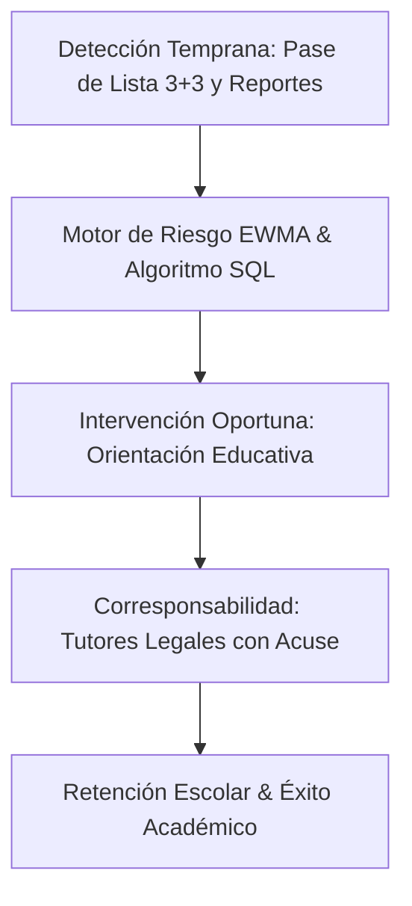
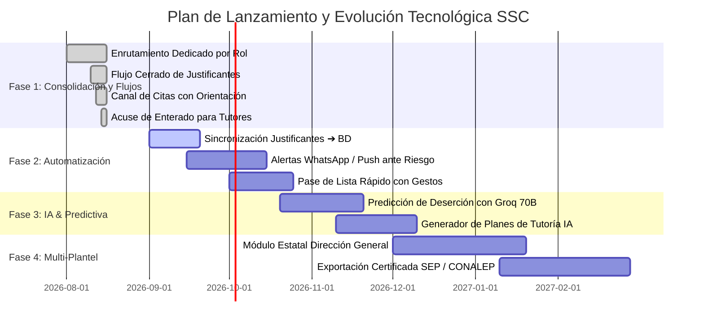

# Roadmap Estratégico de Evolución y Escalabilidad (SSC SaaS)
## Sistema de Semáforo Conductual, Asistencia y Retención Escolar

---

## 1. Visión Ejecutiva del Producto

El **Sistema de Semáforo Conductual (SSC)** es una plataforma SaaS multi-tenant diseñada para instituciones educativas de nivel medio superior y superior (modelo CONALEP). Su objetivo es **erradicar el rezago y la deserción escolar mediante la detección temprana, el refuerzo conductual positivo y el acompañamiento psicopedagógico integral**.

---

## 2. Cronograma de Fases (2026 - 2027)

---

## 3. Desglose Detallado por Fases

### 🟢 Fase 1: Consolidación de Flujos y Experiencia por Rol (Completada - Q3 2026)
* **Enrutamiento Estricto y Pantallas Dedicadas:**
  * Separación arquitectónica completa en `/director`, `/orientador`, `/maestro`, `/alumno` y `/padre`.
* **Flujo Digital de Justificantes:**
  * Solicitud digital con motivo médico/familiar por parte del alumno y bandeja de aprobación en 1 clic para Orientación.
* **Canal Directo de Citas:**
  * Los tutores legales agendan sesiones psicopedagógicas directamente desde su portal.
* **Certeza Jurídica con Acuse de Enterado:**
  * Confirmación de lectura y enterado oficial en el expediente del tutorado.
* **Seguridad y Resiliencia en IA:**
  * CORS restringido al origen institucional (`SITE_URL`), JWT validado y fallback determinístico local grounded.

---

### 🟡 Fase 2: Automatización Operativa y Notificaciones Multicanal (Q4 2026)
1. **Sincronización Automática de Asistencias:**
   * Al aprobarse un justificante en Orientación, actualizar automáticamente los registros de falta a *"Justificada"* en la tabla `asistencias` para todos los docentes del alumno.
2. **Notificaciones Push y WhatsApp (Twilio / Meta Cloud API):**
   * Envío automático de alerta al tutor legal cuando su hijo alcance el **Semáforo Naranja o Rojo**.
   * Recordatorio automático de citas 24 horas antes de la sesión.
3. **Pase de Lista Ágil para Docentes:**
   * Modo *"Todos Presentes"* con 1 toque y selección rápida de méritos positivos mediante chips interactivos.

---

### 🔵 Fase 3: Analítica Predictiva e Inteligencia Artificial Preventiva (Q4 2026 - Q1 2027)
1. **Motor de Predicción Temprana de Deserción:**
   * Análisis de series de tiempo con Groq LLaMA 3.3 70B cruzando:
     * Tendencia EWMA ($\alpha = 0.3$).
     * Frecuencia de retardos en primeras horas.
     * Historial de compromisos incumplidos en bitácora.
2. **Asistente de Planes de Intervención Personalizados:**
   * Sugerencia automática de estrategias psicopedagógicas para orientadores basada en el tipo de riesgo detectado (académico, emocional, conductual o socioeconómico).

---

### 🟣 Fase 4: Escalabilidad Multi-Plantel y Reportes Oficiales (Q1 - Q2 2027)
1. **Panel Directivo Estatal / Regional:**
   * Consolidación multi-plantel para directores generales con comparativas de retención entre planteles y zonas escolares.
2. **Exportador Oficial de Expedientes SEP / CONALEP:**
   * Generación en lote de expedientes certificados en PDF con firma electrónica y código QR de validación.
3. **Optimización de Base de Datos para Alta Concurrencia:**
   * Particionamiento de tablas de auditoría e incidencias por ciclo escolar y caching distribuido en PostgreSQL / Redis.

---

## 4. Matriz de Métricas de Impacto (KPIs de Éxito)

| Métrica | Situación Tradicional | Meta con SSC SaaS |
| :--- | :--- | :--- |
| **Tiempo de Detección de Alumnos en Riesgo** | 45 a 60 días (al final del parcial) | **Menos de 48 horas** (automático por EWMA) |
| **Tiempo de Tramitación de Justificantes** | 3 a 5 días hábiles en papel | **Menos de 15 minutos** (flujo digital 1-clic) |
| **Tasa de Confirmación de Enterado por Padres** | Menos del 25% | **Mayor al 85%** (notificación y acuse digital) |
| **Reducción de Deserción Escolar Anual** | Línea base institucional | **Reducción proyectada del 15% al 25%** |

---

## 5. Arquitectura y Estándares de Calidad

* **Seguridad:** Row Level Security (RLS) multi-tenant con aislamiento por `plantel_id`, trigger anti-recursión `usuarios_rls_bypass` y contraseñas con lockout de fuerza bruta (5 intentos).
* **Frontend:** React 19, TypeScript estricto (**0 errores `tsc -b`**), Vite (**build en <7s**), Recharts y diseño accesible conforme a directrices institucionales.
* **IA Confiable:** Invocación aislada en Supabase Edge Functions con *Zero Hallucination Grounding* y motor determinístico local.
