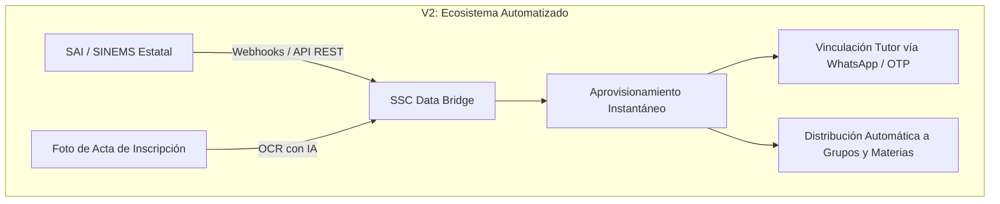

# Análisis y Especificación Técnica: Formato de Carga Masiva (CSV / Excel)
## Propuesta Actual (V1) vs. Proyección a Futuro (V2)

---

## 1. Resumen Ejecutivo

El módulo de **Importación Masiva de Usuarios (Bulk User Import)** es el punto de entrada de datos primario para matricular estudiantes, asignar docentes y dar de alta a padres de familia al inicio de cada ciclo escolar en el Sistema de Seguimiento y Salud Conductual (SSC).

Este documento contrasta la **arquitectura implementada actualmente (V1)** frente a la **proyección y evolución futura (V2)**, analizando la estructura de datos, la tolerancia a errores de captura, la compatibilidad con los sistemas oficiales (SAI CONALEP / SINEMS SEP) y el impacto operativo en el área de Servicios Escolares.

---

## 2. Propuesta Actual (Implementación V1 + Smart Header Matching)

### 2.1. Arquitectura y Funcionamiento Técnico
En la versión actual, el componente [`BulkUserImport.tsx`](file:///c:/Users/User/Documents/SSC/frontend/src/components/BulkUserImport.tsx) procesa archivos en formato `.csv`, `.xlsx` o `.xls` en el navegador del cliente mediante la librería `xlsx` y envía los lotes validados a la Edge Function `batch-provision-users` de Supabase.

### 2.2. Estructura de Columnas (Alumnos y Tutores)

```csv
Matricula,Nombre,Apellido,Email,Grupo,Carrera,Semestre,Email_Tutor,Nombre_Tutor,Apellido_Tutor,Tel_Emergencia
```

| Columna | Obligatorio | Tipo | Destino en Base de Datos | Función en el Sistema |
| :--- | :--- | :--- | :--- | :--- |
| **`Matricula`** | **Sí** | Texto | `public.alumnos.matricula` | Identificador institucional único del estudiante. |
| **`Nombre`** | **Sí** | Texto | `public.usuarios.nombre` | Nombre(s) de pila del alumno. |
| **`Apellido`** | **Sí** | Texto | `public.usuarios.apellido` | Apellido(s) del alumno. |
| **`Email`** | Auto / Sí | Email | `auth.users` y `public.usuarios.email` | Cuenta de inicio de sesión. Si viene vacío, el sistema autogenera `student.{matricula}@conalep.edu.mx`. |
| **`Grupo`** | Recomendado | Texto | `public.grupos.nombre` | Asigna al alumno a su salón (ej. `INFO-201`). |
| **`Carrera`** | Recomendado | Texto | `public.carreras.nombre` | Vincula a la carrera técnica correspondiente. |
| **`Semestre`** | Recomendado | Entero | `public.grupos.semestre` | Semestre actual (`2`, `4`, `6`). |
| **`Email_Tutor`** | Auto / Opc | Email | `auth.users` y `padres_alumnos` | Si viene vacío pero hay tutor/teléfono, autogenera `padre.{matricula}@conalep.edu.mx`. |
| **`Nombre_Tutor`**| Opcional | Texto | `public.usuarios.nombre` (Rol: `padre`) | Nombre del tutor legal. |
| **`Apellido_Tutor`**| Opcional | Texto | `public.usuarios.apellido` (Rol: `padre`) | Apellidos del tutor legal. |
| **`Tel_Emergencia`**| Opcional | Teléfono | `public.contactos_emergency.telefono` | Teléfono primario de urgencias. |

### 2.3. Capacidades Inteligentes Incorporadas (Smart Matching)
* **Tolerancia a Encabezados con Tildes y Sinónimos:** Acepta variaciones como `Matrícula`, `No_Control`, `Paterno` + `Materno`, `Nombre Completo`, `Salón`, `Celular` o `WhatsApp`.
* **Autogeneración Resiliente de Cuentas:** Si el padre o el alumno no tienen correo electrónico en el archivo, el sistema autogenera un identificador sintético para que la carga no se interrumpa.
* **Separación Automática de Nombres:** Si el archivo contiene una sola columna `Nombre Completo` (ej. *"HERNÁNDEZ PÉREZ, JUAN"*), el sistema descompone automáticamente nombres y apellidos.

---

## 3. Proyección a Futuro (Evolución V2)

La versión V2 proyecta eliminar por completo el trabajo manual de exportar e importar archivos planos mediante las siguientes 4 innovaciones:



### 3.1. Innovaciones Clave de la Versión V2:

1. **Sincronización Directa vía API con el SAI (Sistema de Administración Institucional):**
   * Eliminación del archivo CSV intermedio. El sistema se conecta cada 24 horas mediante un servicio background seguro (Webhook) para sincronizar altas, bajas y cambios de grupo directamente desde la base de datos central de CONALEP.
2. **Vinculación de Padres mediante WhatsApp / SMS OTP (Sin Correo Electrónico):**
   * El padre de familia no requiere recordar un correo electrónico ni contraseña. Ingresa su número celular a 10 dígitos y recibe un código OTP de 6 dígitos por WhatsApp/SMS para acceder a su portal tutelar de inmediato.
3. **Escaneo OCR con Inteligencia Artificial de Fichas de Inscripción Físicas:**
   * Para planteles con procesos de inscripción física en papel, la secretaria escolar puede tomar una fotografía de la solicitud de inscripción y la IA extrae automáticamente la CURP, matrícula, tipo de sangre, alergias y teléfonos de contacto.
4. **Mapeo Biunívoco con la CURP como Llave Universal:**
   * Adopción de la Clave Única de Registro de Población (CURP) de 18 caracteres como identificador maestro nacional, permitiendo transferencias de alumnos entre planteles del estado sin duplicar historiales de salud conductual.

---

## 4. Matriz Comparativa: Propuesta Actual (V1) vs. Proyección Futura (V2)

| Criterio de Evaluación | Propuesta Actual (V1 Implementada) | Proyección a Futuro (V2) |
| :--- | :--- | :--- |
| **Método de Carga** | Archivo `.csv` / `.xlsx` arrastrado al navegador web. | **Sincronización API en tiempo real + Webhooks del SAI.** |
| **Tiempo de Procesamiento** | ~10 segundos para 750 alumnos (en lotes de 50). | **Instantáneo en segundo plano sin intervención humana.** |
| **Tolerancia a Formatos** | Mapeo inteligente de sinónimos y autogeneración de correos. | **Validación estricta de estructura RENAPO (CURP validada).** |
| **Acceso para Tutores** | Correo electrónico institucional (`padre.X@conalep.edu.mx`). | **Acceso sin contraseña mediante WhatsApp / SMS OTP.** |
| **Gestión de Datos Médicos** | Opcional en plantilla extendida. | **Extracción automática vía OCR desde el certificado médico.** |
| **Dependencia Operativa** | Requiere que Servicios Escolares descargue y suba el archivo. | **100% autónomo y sincronizado con control escolar central.** |
| **Seguridad y Validación** | Previsualización en pantalla con semáforo de errores. | **Validación criptográfica y conciliación automática de bajas.** |

---

## 5. Ejemplos Prácticos de Archivos Compatibles con la Versión Actual (V1)

### Ejemplo 1: Plantilla Estándar Oficial (Recomendada)
```csv
Matricula,Nombre,Apellido,Email,Grupo,Carrera,Semestre,Email_Tutor,Nombre_Tutor,Apellido_Tutor,Tel_Emergencia
260000001,Alejandro,Lopez Hernandez,student.1@conalep.edu.mx,INFO-201,Informatica,2,padre.1@conalep.edu.mx,Marta,Lopez,2227182718
260000002,Carlos,Perez Gomez,student.2@conalep.edu.mx,INFO-201,Informatica,2,padre.2@conalep.edu.mx,Ximena,Perez,2227568241
260000003,Sofia,Martinez Ruiz,student.3@conalep.edu.mx,ADMN-401,Administracion,4,padre.3@conalep.edu.mx,Roberto,Martinez,2226589780
```

### Ejemplo 2: Exportación Directa de Excel con Apellidos Separados y Sin Correos (Soportada por Smart Matching)
```csv
No_Control,Primer_Apellido,Segundo_Apellido,Nombre,Grupo,Telefono_Tutor,Nombre_Tutor
260000004,GARCIA,SALAZAR,SEBASTIAN,INFO-201,2221458963,ROSA SALAZAR
260000005,GONZALEZ,FLORES,ANGEL,INFO-201,2223698521,MANUEL GONZALEZ
260000006,DIAZ,FLORES,DANIEL,INFO-201,2227894561,CARMEN FLORES
```

---

## 6. Conclusión Técnica

La **Versión 1 actual** resuelve de manera sobresaliente la necesidad inmediata de aprovisionamiento masivo para el ciclo escolar 2026, combinando alta velocidad de procesamiento con tolerancia inteligente a variaciones de captura en Excel. 

La **Versión 2 proyectada** traza la ruta hacia una integración institucional profunda con el ecosistema digital estatal, posicionando a la institución como un referente nacional en automatización y retención escolar.
